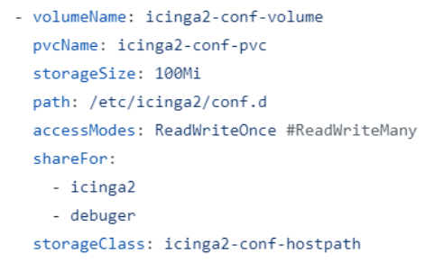
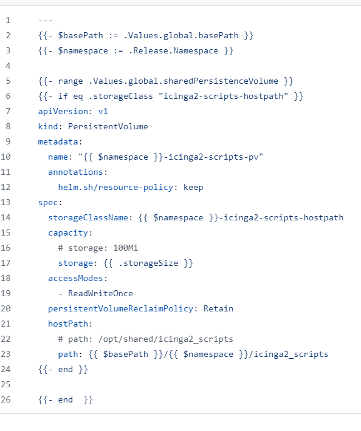
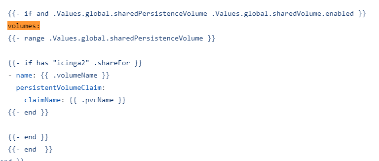

## Add a new persistent volume to a subchart

There are 3 steps to add a new persistent volume to a subchart:

- <b>Step 1: </b>Declare new block in global.sharedPersistenceVolume variable in values.yaml of a stackchart (example [values.yaml](https://github.com/svtechnmaa/stacked_charts/blob/master/kubernetes/nmaa/values.yaml) file of NMAA stack)

- <b>Step 2: </b>Add helm template for the persistent volume in chart [host-path-pv](https://github.com/svtechnmaa/charts/tree/main/kubernetes/host-path-pv/templates)

- <b>Step 3: </b>Add persistent volume claim to claim created persistent volume in subchart helm template

### Step details
#### Step 1:
Declare new block described as below into <b>global.sharedPersistenceVolume</b> variable in <i>values.yaml</i> file of stack chart

Meaning of each value above:
- <b>volumeName:</b> persistent volume's name
- <b>pvcName:</b> persistent volume claim's name, which will claim persistent volume
- <b>shareFor:</b> which subcharts will use this persistent volume 
- <b>storageClass:</b> storage class name, persistent volume claim will claim persistent volume which has the same storage class name

After added this block into <b>global.sharedPersistenceVolume</b> variable, chart [shared-volume](https://github.com/svtechnmaa/charts/tree/main/kubernetes/shared-volume) will automatically for loop through <b>global.sharedPersistenceVolume</b> variable and create all declared persistent volume claim. So it is necessary to include [shared-volume](https://github.com/svtechnmaa/charts/tree/main/kubernetes/shared-volume) into stack chart

#### Step 2:
Add helm template for the persistent volume in chart [host-path-pv](https://github.com/svtechnmaa/charts/tree/main/kubernetes/host-path-pv/templates) with format described as below (example of [icinga2-scripts-volume](https://github.com/svtechnmaa/charts/blob/main/kubernetes/host-path-pv/templates/icinga2-scripts.yaml)):

#### Step 3:
In the <i>volumes</i> block of a deployment or statefulset in a subchart, add code described as below: 

The if statement ensures only persistent volume used by that subchart be listed.

