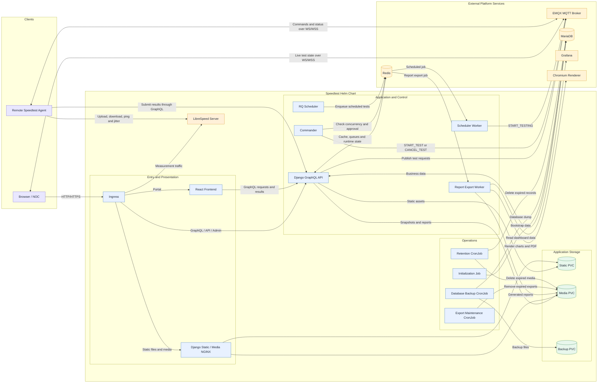

# SVTECH Centralized Speedtester

Helm chart for the application-owned parts of SVTECH Centralized Speedtester. It deploys the Django control plane, React portal, MQTT Commander, scheduler workers, LibreSpeed server, reporting workers, application storage claims, and ingress routes.

MariaDB, Redis, EMQX, Grafana, Chromium, and the storage provisioner are external infrastructure and are not created by this chart.

## Template Layout

Templates are grouped by runtime responsibility. Helm renders these directories recursively.

```text
templates/
├── auth/          # Database, MQTT, and Django bootstrap Secret
├── backend/       # Django API, static server, Service, and DB Secret
├── commander/     # MQTT Commander workload
├── frontend/      # React frontend workload and Service
├── networking/    # Application ingress routes
├── operations/    # Bootstrap, database backup, and retention jobs
├── reporting/     # Report export worker and maintenance CronJob
├── scheduler/     # RQ scheduler and execution worker
├── storage/       # Application PVCs
└── test-server/   # LibreSpeed workload and Service
```

## Component Purposes

| Component | Purpose |
|-----------|---------|
| Frontend | React portal for local and remote tests, administration, history, reports, and MQTT live state. |
| Django backend | GraphQL/API/admin control plane for authentication, tenancy, RBAC, configuration, result persistence, SLA evaluation, and report requests. |
| Django static | Nginx service for Django static files, uploaded media, test snapshots, and generated reports. |
| Commander | MQTT control process that checks Redis-backed concurrency and agent approval before publishing `START_TEST` or `CANCEL_TEST`. The legacy values and workload names use `mqttLogger` and `mqtt-logger`. |
| Scheduler | RQ Scheduler process that materializes saved site and site-group cron schedules. |
| Scheduler worker | Executes scheduled jobs and publishes test requests through MQTT. |
| Test server | LibreSpeed Go endpoint that handles upload, download, ping, and jitter measurement traffic. |
| Report export worker | Consumes the `report_export` RQ queue, renders charts/documents, and writes output to media storage. |
| Report maintenance | Removes expired exports and handles stale export jobs. |
| Init-data job | Creates initial application users, settings, and test-server data when explicitly enabled. |
| Backup job | Creates MariaDB backups and removes backups older than the configured retention period. |
| Retention job | Removes expired tenant results, SLA history, snapshots, and related media. |
| Ingress | Routes frontend, GraphQL/API/admin, static/media, and LibreSpeed paths. |
| Storage claims | Provide shared storage for static files, media, frontend artifacts, operational logs, and database backups. |

Remote `speedtest-agent` instances run at monitored sites and are intentionally outside this central chart.

## Speedtest Deployment and Operational Flow

The following diagram describes how the Speedtest components are deployed and communicate in Kubernetes. It represents this Helm chart and may differ from the upstream application's development architecture.




## Prerequisites

- Kubernetes 1.29 or newer and Helm 3.14
- An ingress controller
- External MariaDB reachable through `db.host` and `db.port`
- External Redis reachable through `redis.host` and `redis.port`
- EMQX with MQTT over WS/WSS matching `mqtt` and `vite` settings
- Grafana endpoints required by the application dashboards
- Chromium CDP endpoint when report chart rendering is enabled
- A suitable Kubernetes StorageClass for each application PVC


## Important Configuration

- `global.frontendVip`: public IP address or hostname used by application URLs.
- `global.enableHttps`: switches generated public URLs between HTTP and HTTPS.
- `global.speedtest.runInitDataJob`: enables the one-time initialization job for creating default users, settings, and test-server data.
- `timezone`: container timezone; `global.timezone` overrides it when set.
- `replicaCounts`: replica settings for application workloads.
- `image`: image registry, repository, and tag for each application component.
- `pvc`: claim name, StorageClass, and capacity for application file storage.
- `auth`: optional existing Secret shared by database, MQTT, and Django bootstrap authentication.
- `db`: external MariaDB connection and managed-Secret source values.
- `redis`: external Redis connection used for runtime state, caching, channels, and RQ.
- `mqtt`: external EMQX connection, Commander limits, and managed-Secret source values.
- `vite`: browser-visible MQTT and frontend build settings.
- `django`: Django, multi-tenant, reporting, and bootstrap settings.
- `paths`: ingress and frontend path prefixes.

## Credential Secrets

Database, MQTT, and Django bootstrap credentials are stored in one shared Secret:

1. Leave `auth.existingSecret` empty. The chart creates `<fullname>-auth` from the `db`, `mqtt`, and `django` credential values.
2. Set `auth.existingSecret`. The chart references that Secret and does not create a replacement.

For the default release, the managed Secret is named `speedtest-auth`. It contains:

```text
DB_NAME
DB_USER
DB_PASSWORD
DB_HOST
DB_PORT
MQTT_BROKER_USERNAME
MQTT_BROKER_PASSWORD
DJANGO_SUPERUSER_USERNAME
DJANGO_SUPERUSER_EMAIL
DJANGO_SUPERUSER_PASSWORD
```

Use a Secret with the default key names by setting its name directly:

```yaml
auth:
  existingSecret: company-speedtest-auth
```

When an existing Secret uses different keys please use with `name` and `keyMapping` format :

```yaml
auth:
  existingSecret:
    name: company-speedtest-auth
    keyMapping:
      DB_NAME: database-name
      DB_USER: database-user
      DB_PASSWORD: database-password
      DB_HOST: database-host
      DB_PORT: database-port
      MQTT_BROKER_USERNAME: mqtt-user
      MQTT_BROKER_PASSWORD: mqtt-password
      DJANGO_SUPERUSER_USERNAME: admin-user
      DJANGO_SUPERUSER_EMAIL: admin-email
      DJANGO_SUPERUSER_PASSWORD: admin-password
```


## Application Paths

| Value | Default purpose |
|-------|-----------------|
| `paths.userPortal` | React portal |
| `paths.adminPortal` | Django admin |
| `paths.backendApi` | Backend REST endpoints |
| `paths.backendGraphQl` | GraphQL endpoint |
| `paths.staticDjango` | Django static files |
| `paths.mediaDjango` | Uploaded files, snapshots, and reports |
| `paths.speedtestServer` | LibreSpeed endpoint |


## Installation

Review `values.yaml`, then install or upgrade the release:

```sh
helm upgrade --install speedtest . --namespace speedtest --create-namespace
```

Validate the release:

```sh
helm lint .
helm template speedtest .
kubectl get pods,svc,ingress,pvc -n speedtest
```


## Uninstall

```sh
helm uninstall speedtest --namespace speedtest
```

PVC retention depends on the StorageClass reclaim policy. Verify backups before manually deleting claims.
